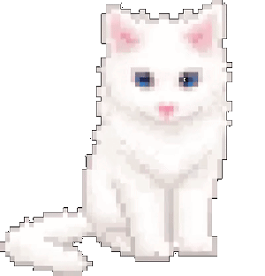

<br>

<p align="center">
  
</p>

<p align="center">
</p>

<br>

<h1 align="center">NedoModules</h1>

<p align="center">
  <i>A collection of custom modules for Hikka and Heroku userbots.</i>
</p>

<br>

## 📋 Overview
This repository contains self-written modules for userbots.<br>
I made them for myself, sharing as-is.

<b>Disclaimer:</b>
- Some modules are stable, some are experimental.<br>
- If something breaks — congratulations, you're now a beta tester.

## ⚠️ Notes
- Modules may depend on specific userbot features<br>
- Backward compatibility is not guaranteed<br>
- Expect breaking changes (I'm learning, it happens)

<br>

## 📦 Available Modules

### <b>NeuralChat [BETA]</b>
>Universal AI chat module with API support (OpenAI, Claude, Gemini, local models).<br>
>Features streaming, file analysis, code generation, and customizable prompts.

### <b>YouDownloader V2.2.6</b>
>Just download YouTube video in any chat from @SaveYoutubeBot, I'm lazy

>(there's a lot of bugs btw)

### <b>MusicBot V5.4.1</b>
>Download music in any chat with @mus_vir_bot

>Has many bugs with music select⚠️

## 🛠 Installation
```Heroku
.dlm https://raw.githubusercontent.com/Nedomyzekant/NedoModules/main/NeuralChat.py
```
<small>other idk lol ᘛ⁐̤ᕐᐷ</small>

<br>

## 🤝 Contributing
Pull requests are welcome if you know what you're doing.<br>
Garbage PRs will be ignored or closed without explanation.